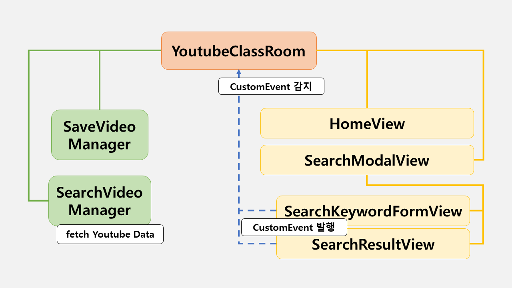
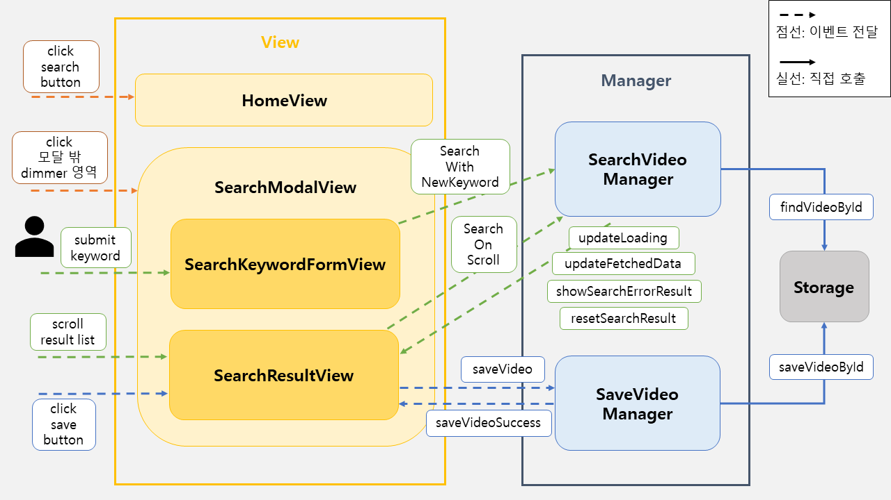

<p align="middle" >
  
</p>
<h2 align="middle">level1 - 나만의 유튜브 강의실</h2>
<p align="middle">자바스크립트와 외부 API를 이용해 구현 하는 나만의 유튜브 강의실</p>
<p align="middle">
  
  
  
  
  
</p>

<br />

## [💻 나만의 유투브 강의실 데모 페이지](https://soyi47.github.io/javascript-youtube-classroom/)

<br />

## 기능 구현 목록

1. 메인 화면 검색 버튼 누르기

- 검색 모달 창이 나온다.

2. 검색하기

- 엔터키를 눌러 검색할 수 있다.
- 검색 버튼을 클릭해 검색할 수 있다.
- 입력 조건
  - 검색 키워드는 2자 이상이어야 한다.

3. 검색 결과 가져오기

- 결과를 가져 오는 동안 스켈레톤 이미지를 보여준다.
- YouTube 검색 API를 이용하여 영상 검색 결과를 가져온다.

4. 검색 결과 보여주기

- 결과를 가져오는데 실패한 경우, 에러 결과 화면을 보여준다.
- 결과가 없으면 결과 없음 이미지를 보여준다.
- 결과가 있으면 최대 10개까지 보여준다.
  - 결과 화면에서 스크롤 바를 끝까지 이동시키면 추가 검색 결과 10개를 불러온다.
  - 추가로 가져올 검색 결과가 없는 경우, 마지막 결과까지 가져왔다는 안내 문구를 띄운다.
  - 이미 저장된 영상이라면 저장 버튼이 보이지 않도록 한다.

5. 원하는 영상 저장하기

- 저장 버튼을 누르면
  - 영상 id를 Web Storage에 저장한다. 이때 시청 기록 정보(watched)를 false로 함께 저장한다.
  - 저장 버튼이 보이지 않도록 한다.
- 저장 가능한 최대 동영상의 갯수는 100개이다.

6. 저장된 영상 확인하기

- 기본 메인 화면은, '볼 영상'의 리스트를 보여준다.
- '본 영상', '볼 영상' 버튼을 눌러 각 리스트 화면으로 변경할 수 있다.
- 저장된 영상이 없는 경우, 사용자에게 비어있다는 것을 문구를 보여준다.

7. 저장된 영상 상태 변경하기

- 영상 카드의 ✅ 버튼을 클릭하면, 시청 기록 정보(watched)가 변경된다. (true <-> false)
- 영상 카드의 🗑️ 버튼을 클릭하면, 저장된 영상 리스트에서 삭제할 수 있다.
  - 이때 `confirm`을 이용하여, 사용자에게 정말 삭제할 것인지 재확인한다.

## UI

- figma 시안을 기준으로 구현한다.
- 사용자 디바이스 가로 길이에 따라 영상 카드 목록(저장된 영상, 검색 결과)의 row 당 column 개수를 변경한다.
  - 1280px 이상: 4개
  - 960px 이상 ~ 1280px 미만: 3개
  - 600px 이상 ~ 960px 미만: 2개
  - 600px 미만: 1개

<br />

## 개요도

### Step 1

#### 초기 개요도



<br />

#### 1차 수정 - 주요 흐름도



<br />

####  로컬에서 서버 띄워서 손쉽게 static resources 변경 및 확인하는 방법

로컬에서 웹서버를 띄워 html, css, js 등을 실시간으로 손쉽게 테스트해 볼 수 있습니다. 이를 위해서는 우선 npm이 설치되어 있어야 합니다. 구글에 `npm install` 이란 키워드로 각자의 운영체제에 맞게끔 npm을 설치해주세요. 이후 아래의 명령어를 통해 실시간으로 웹페이지를 테스트해볼 수 있습니다.

```
npm install -g live-server
```

실행은 아래의 커맨드로 할 수 있습니다.

```
live-server 폴더명
```

<br>

## 👏 Contributing

만약 미션 수행 중에 개선사항이 보인다면, 언제든 자유롭게 PR을 보내주세요.

<br>

## 🐞 Bug Report

버그를 발견한다면, [Issues](https://github.com/woowacourse/javascript-youtube-classroom/issues)에 등록해주세요.

<br>

## 📝 License

This project is [MIT](https://github.com/woowacourse/javascript-youtube-classroom/blob/main/LICENSE) licensed.
