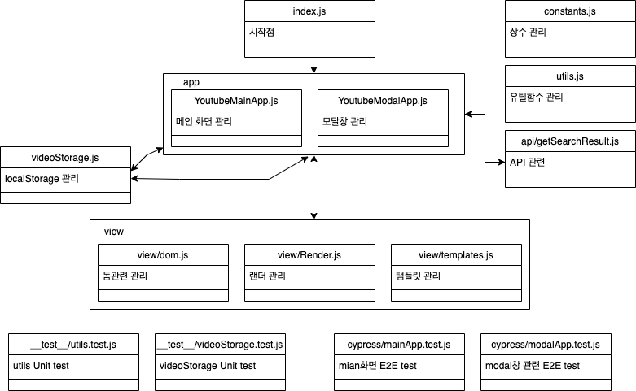

<p align="middle" >
  
</p>
<h2 align="middle">level1 - 나만의 유튜브 강의실</h2>
<p align="middle">자바스크립트와 외부 API를 이용해 구현 하는 나만의 유튜브 강의실</p>
<p align="middle">
  
  
  
  
  
</p>

## 데모 페이지

[👩🏻‍💻 나만의 유튜브 강의실 🧑🏻‍💻 ](https://kkojae91.github.io/javascript-youtube-classroom/)

Youtube API 호출 횟수가 많이 할당되어 있지 않습니다... 과도한 검색을 하시게 된다면 프로그램이 죽어요....ㅠ 🥲

## Before Started

---

E2E 테스트는 아래의 커맨드로 확인할 수 있습니다.

```bash
npm run cypress:test
```

Unit 테스트는 아래의 커맨드로 확인할 수 있습니다.

```bash
npm run test
```

## 프로젝트 다이어그램

---



<br />

## 구현할 기능 목록

---

### STEP1

- [x] 메인 화면에서 검색 버튼을 누르면 검색 모달창이 나타난다.
- [x] 유튜브 검색 API를 사용해 내가 보고 싶은 영상들을 검색할 수 있다.
  - 엔터키를 눌러 검색할 수 있다.
  - 검색 버튼을 클릭해 검색할 수 있다.
  - 디바운스를 사용하여 API호출을 최소화한다.
- [x] 데이터를 불러오는 동안 현재 데이터를 불러오는 중임을 skeleton UI로 보여준다.
- [x] 검색 결과가 없는 경우 결과 없음 이미지를 보여준다.
- [x] 최초 검색 결과는 10개까지만 보여준다.
  - 브라우저 스크롤 바를 끝까지 내려 그 다음 10개 아이템을 추가로 불러온다.
  - 스로틀를 사용하여 이벤트 콜백함수 호출을 최소화한다.
- [x] 내가 검색한 영상들의 JSON 데이터를 localStorage에 저장한다.
  - 저장 가능한 최대 동영상의 갯수는 100개이다.
- [x] 이미 저장된 영상이라면 저장 버튼이 보이지 않도록 한다.

### STEP2

- [x] 가장 처음에는 저장된 영상이 없으므로, 비어있다는 것을 사용자에게 알려주는 상태를 보여준다.
- [x] 이후 페이지를 방문했을 때 기본 메인 화면은 내가 볼 영상들의 리스트를 보여준다.
- [x] 영상 카드의 이모지 버튼을 클릭하여 아래와 같은 상태 변경이 가능해야 한다.
  - [x] ✅ 본 영상으로 체크
  - [x] 🗑️ 버튼으로 저장된 리스트에서 삭제할 수 있다. (삭제 시 사용자에게 정말 삭제할 것인지 물어봅니다.)
- [x] 본 영상, 볼 영상 버튼을 눌러 필터링 할 수 있다.
- [x] 반응형 웹: 유저가 사용하는 디바이스의 가로 길이에 따라 검색결과의 row 당 column 갯수를 변경한다.
  - 1280px 이상: 4개
  - 960px이상~1280px 미만: 3개
  - 600px이상~960px 미만: 2개
  - 600px 미만: 1개

## 테스트 요구사항

---

- [x] 단위 테스트를 Jest로 작성한다.
- [x] E2E 테스트를 Cypress로 작성한다.

## 배포

---

- [x] 실행 가능한 페이지에 접근할 수 있도록 github page 기능을 이용하고, 해당 링크를 PR과 README에 작성한다.
- API key를 public repo에 올리지 않은 채로 데모 페이지를 배포하려면, 별도의 설정이 추가로 필요합니다.

## 📝 License

---

This project is [MIT](https://github.com/woowacourse/javascript-youtube-classroom/blob/main/LICENSE) licensed.
